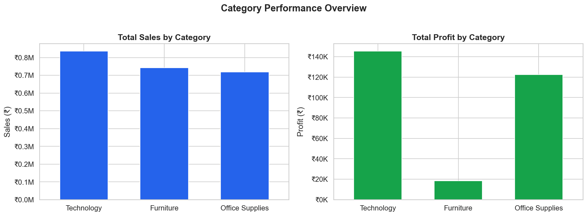
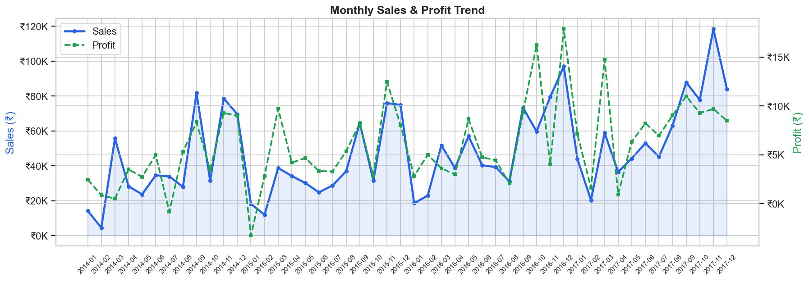
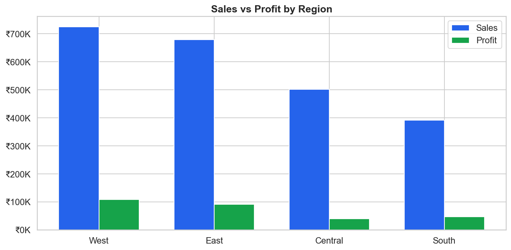

# 📊 Retail Sales Performance Analysis

A complete end-to-end Business Analysis project analyzing 10,000+ retail 
transactions to uncover sales trends, regional performance, customer segments, 
and discount impact using Python and Streamlit.

---

## 🔍 Business Problem

A retail chain wants to understand which products, regions, and time periods 
are driving revenue — and where sales are declining — to make smarter 
inventory and marketing decisions.

---

## 🛠️ Tools & Technologies

| Tool | Purpose |
|---|---|
| Python (Pandas) | Data cleaning & analysis |
| Matplotlib & Seaborn | Static visualizations |
| Plotly | Interactive charts |
| Streamlit | Live web dashboard |

---

## 💡 Key Business Insights

- **Technology** generates the highest profit (~$145K) despite similar 
  sales volume to Furniture
- **Furniture** has only 2.5% profit margin — heavy discounting is the 
  likely cause
- Orders with **>30% discount** generate negative average profit — 
  recommend capping discounts at 20%
- **Q4 (Oct–Dec)** consistently drives the highest sales across all years
- **West region** is the most profitable; Central region underperforms

---

## 📁 Project Structure
```
retail-sales-analysis/
│
├── retail_sales_analysis.py   # Full EDA + analysis script (9 charts)
├── streamlit_app.py           # Interactive web dashboard
├── Sample - Superstore.csv    # Dataset (Kaggle Superstore)
├── plot1_category_performance.png
├── plot2_subcategory_profit.png
├── plot3_regional_performance.png
├── plot4_monthly_trend.png
├── plot5_quarterly_heatmap.png
├── plot6_segment_analysis.png
├── plot7_discount_impact.png
├── plot8_customer_profitability.png
└── plot9_shipping_analysis.png
```

---

## ▶️ How to Run
```bash
# Install dependencies
pip install pandas matplotlib seaborn plotly streamlit

# Run static analysis (saves 9 PNG charts)
python retail_sales_analysis.py

# Launch interactive dashboard
streamlit run streamlit_app.py
```

---

## 📊 Dashboard Preview





---

## 🎯 Business Recommendations

1. **Cap discounts at 20%** — anything above destroys profit margin
2. **Investigate Furniture pricing** — high revenue but very low profit
3. **Double down on West & East regions** — highest ROI
4. **Increase Corporate segment focus** — better margins per order
5. **Plan inventory for Q4** — consistently highest demand period

---

*Built as part of a Business Analyst portfolio project*
